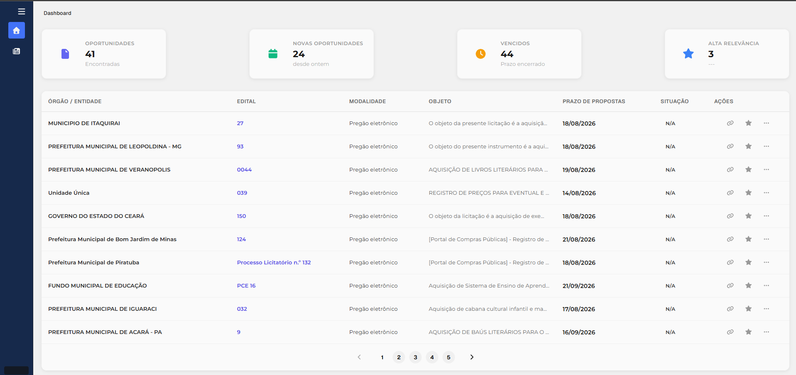

# 🔎 LicitaScan — Frontend

Interface web do **LicitaScan**, uma plataforma desenvolvida para centralizar, organizar e facilitar o acompanhamento de oportunidades em licitações públicas.

O objetivo é transformar a busca por oportunidades em um processo mais rápido e visual, permitindo que empresas encontrem licitações relevantes sem precisar consultar diversos portais individualmente.

## 📸 Demonstração

> Dashboard principal do LicitaScan.

## ✨ Funcionalidades

* 📊 Dashboard com visão geral das oportunidades
* 🔎 Pesquisa de licitações
* 🎯 Filtros por diferentes critérios
* 📋 Listagem paginada de oportunidades
* 📄 Visualização dos detalhes da licitação
* 🔗 Acesso à fonte original da oportunidade
* 🆕 Identificação de novas oportunidades
* 📅 Informações sobre datas e prazos
* 🏛️ Informações do órgão responsável
* 🌐 Organização das oportunidades por portal

## 🛠️ Tecnologias

* React
* TypeScript
* Vite
* Tailwind CSS
* TanStack Query
* React Router

## 🚧 Tasks

### Dashboard

* [x] Criar layout inicial
* [x] Criar dashboard
* [x] Criar cards de indicadores
* [x] Criar listagem de oportunidades
* [x] Implementar paginação
* [ ] Melhorar indicadores
* [ ] Adicionar gráficos
* [ ] Adicionar identificação de novas oportunidades

### Oportunidades

* [x] Listar oportunidades
* [x] Exibir informações principais
* [x] Criar página de detalhes
* [x] Link para fonte original
* [ ] Sistema de favoritos
* [ ] Histórico de oportunidades
* [ ] Status de acompanhamento

### Pesquisa e filtros

* [x] Pesquisa por palavra-chave
* [x] Filtro por modalidade
* [x] Filtro por período
* [ ] Filtros avançados
* [ ] Salvar filtros
* [ ] Busca personalizada por empresa

### Interface

* [x] Layout responsivo
* [x] Componentes reutilizáveis
* [x] Navegação entre páginas
* [ ] Melhorias de UX
* [ ] Tema claro/escuro
* [ ] Responsividade mobile aprimorada

### Futuro

* [ ] Sistema de notificações
* [ ] Alertas de novas oportunidades
* [ ] Configuração de palavras-chave
* [ ] Área da empresa
* [ ] Dashboard personalizado
* [ ] Análises e métricas
* [ ] Integração com novos portais

---

## 📌 Status

🚧 **Em desenvolvimento**

O LicitaScan está evoluindo de um sistema de consulta de licitações para uma plataforma completa de **monitoramento e gestão de oportunidades públicas**.
